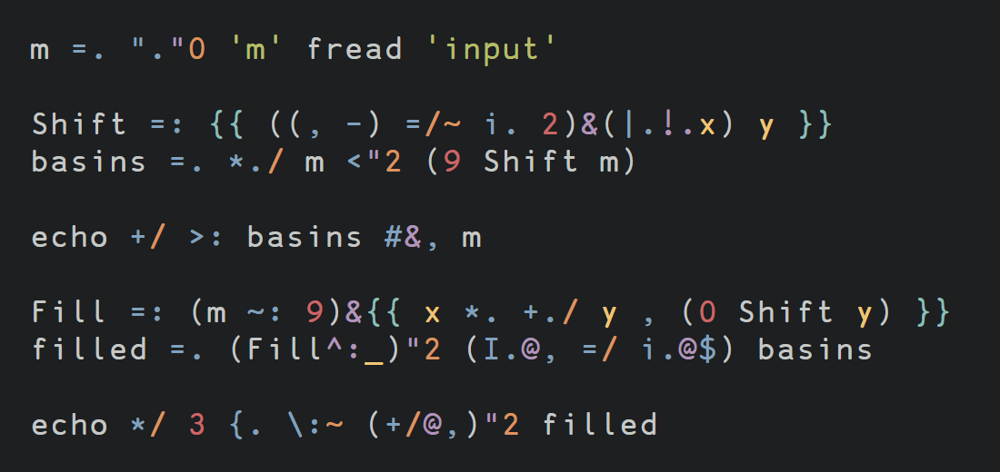
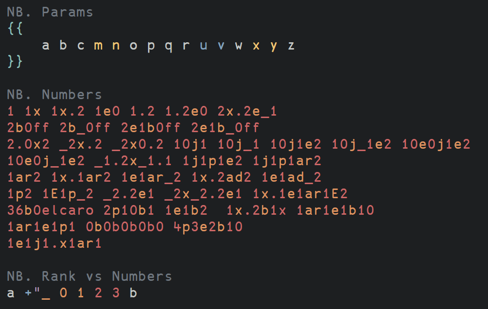

# highlightjs-j

A third-party highlightjs library for the [J](https://www.jsoftware.com) programming language.

See also

  * My [J syntax file for vim](https://github.com/0racle/vim-j)

# Testing
Do the following for testing the highlighting on a browser. See the
[highlightjs docs](https://highlightjs.readthedocs.io/en/latest/building-testing.html) for more.

```
git clone https://github.com/highlightjs/highlight.js.git
cd highlight.js/
cd extra/
git clone https://github.com/0racle/highlightjs-j.git
cd ..
npm install
node tools/build.js -t browser
```

Then you can open `tools/developer.html` from the highlightjs repository to test the detection and highlighting of J.
In the dropdown, J will be at the very end.

# Screenshots
Example screenshot using the `hybrid` theme.






